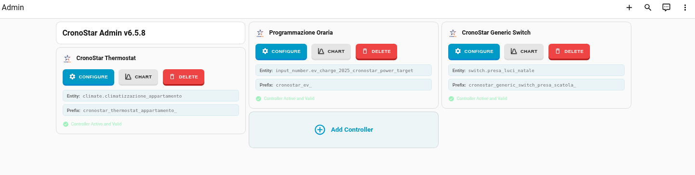
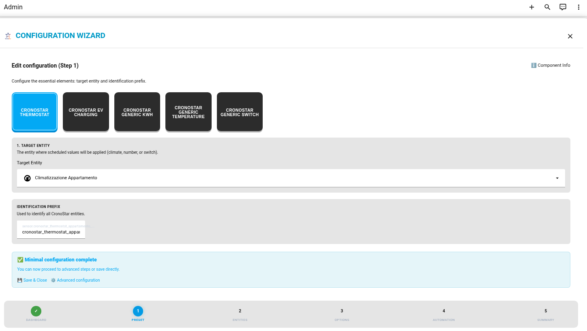

# CronoStar for Home Assistant

[](https://github.com/hacs/integration)
[](https://github.com/FoliniC/cronostar/releases)
[](LICENSE)
[](https://github.com/FoliniC/cronostar)
[](https://github.com/FoliniC/cronostar)

Easily add time-based schedules to any entity.
 The integration uses standard Home Assistant entities and coordinators, stores its settings in editable JSON files, and provides an intuitive visual interface to manage all your time profiles. 


## 📊 Administration & Dashboard

CronoStar now features a centralized **Admin Dashboard** designed for easy management of all your schedules.



### 🛠️ Creating a Controller
There are three ways to add a new CronoStar Controller to your system:

1.  **Centralized Dashboard**: Open the editor on any existing CronoStar card and navigate to the **Dashboard (Step 0)**. From here, you can click "New Configuration" to start the wizard for a brand new controller.
2.  **Lovelace Card Wizard**: Add a new `custom:cronostar-card` to any Lovelace view. If the card is empty, it will automatically launch the **Visual Wizard** to help you create a new configuration.



3.  **Config Flow**: Go to **Settings** → **Devices & Services** → **Add Integration** and search for **CronoStar**. This will initiate the standard Home Assistant configuration flow to set up a new instance.
    *   *Note: Use the **Options Flow** (Configure button on an existing entry) to modify parameters of an already created controller.*

## 🎯 What's New in v6.1.1

### 📊 Enhanced Admin Hub
- **Unified Management**: The new Dashboard (Step 0) allows you to monitor all active controllers, their status, and their target entities from a single view.
- **Improved Setup Flow**: Refined the distinction between the Initial Setup (**Config Flow**) and subsequent adjustments (**Options Flow**), ensuring a seamless experience regardless of where you start.
- **Translation Boost**: Full English and Italian support for all new dashboard components and wizard steps.

### 🧪 Internationalized Test Suite
- **English Test Descriptions**: Translated all Italian test descriptions and comments to English across the entire frontend test suite (Vitest).
- **Standardized Terminology**: Unified testing language to follow industry standards ("should return...", "renders...").

## 🎯 What's New in v6.1.0

### 📊 Optimized Admin Dashboard
- **Conditional Chart Loading**: Added a toggle button for each controller to show/hide the programming chart. This prevents browser overload by loading heavy graphical components only when needed.
- **Permanent Admin View**: The compact textual information (Admin Mode) remains always visible for quick status checks.
- **Automatic Helper Integration**: The dashboard now automatically manages visibility states via dedicated `input_boolean` entities.

## ✨ Features

### 🔧 Integration (Backend)
- **Automatic Setup**: Handles folder creation and internal configuration.
- **Multiple Preset Types**: Thermostat, EV Charging, Generic Switch, Temperature, Power, Cover.
- **Unified Storage**: Profiles stored in `/config/cronostar/profiles/` as structured JSON.
- **Real-time Synchronization**: Changes in the UI are immediately reflected in the backend entities.

### 🎨 Lovelace Card (Frontend)
- **Visual Editor**: Interactive chart with drag-and-drop support.
- **Multi-Point Selection**: Select groups of points via Shift+click or selection box.
- **Smart Keyboard Controls**: Use arrow keys for precise value and time adjustments.
- **Responsive Design**: Optimized for desktop, tablet, and mobile (touch support).

### 🖱️ Mouse Usage
- **Add Points**: Left-click on empty space to insert a new point.
- **Selection**: Click on a point to select it.
- **Multiple Selection**:
  - **Ctrl / Cmd + Click**: Add/remove individual points.
  - **Shift + Click**: Select a range of points.
  - **Selection Box**: Drag on an empty area to draw a rectangle over points.
- **Adjust Values**: Drag a point up or down. Selected groups move together.
- **Adjust Time**: Drag a point left or right to change its scheduled time.
- **Delete**: Right-click on a point to remove it.
- **Alignment**: **Alt + Left Click** aligns selected points to the leftmost value; **Alt + Right Click** to the rightmost.
- **Zoom**: 
  - **Horizontal**: Mouse wheel (or pinch) while hovering over the **X-axis** (bottom).
  - **Vertical**: Mouse wheel (or pinch) while hovering over the **Y-axis** (left).
  - **Pan**: Click and drag on the respective axis to move the view.

### ⌨️ Keyboard Usage
- **UP / DOWN Arrows**: Increase or decrease the value of selected points.
- **LEFT / RIGHT Arrows**: Move selected points in time (1 min steps, or 30 min with **Shift**).
- **Modifiers**:
  - **Ctrl / Cmd**: Fine adjustment (smaller value increments).
  - **Shift**: Snap to integer values (Y-axis) or 30-minute intervals (X-axis).
- **Shortcuts**:
  - **Ctrl + Z / Y**: Undo / Redo.
  - **Ctrl + A**: Select all points.
  - **Alt + Q**: Insert point halfway between selection and next point.
  - **Alt + W**: Delete currently selected point(s).
  - **Esc**: Deselect all.
  - **Enter**: (If configured) Apply changes immediately.

## 📁 Structure

### Backend (`custom_components/cronostar/`)
```
├── __init__.py                 # Main entry point
├── manifest.json               # Integration metadata
├── services.yaml               # Service definitions
│
├── setup/                      # Setup modules
│   ├── __init__.py            # Main setup orchestrator
│   ├── services.py            # Service registration
│   └── validators.py          # Environment validation
│
├── services/                   # Service handlers
│   └── profile_service.py     # Profile CRUD operations
│
├── storage/                    # Storage management
│   ├── storage_manager.py     # Profile persistence
│   └── settings_manager.py    # Global settings
│
└── utils/                      # Utilities
    ├── prefix_normalizer.py  # Prefix handling
    ├── filename_builder.py   # Filename conventions
    └── error_handler.py       # Error management
```

### Frontend (`www/cronostar_card/src/`)
```
├── core/                      # Core modules
│   ├── CronoStar.js          # Main card component
│   ├── EventBus.js           # Event system
│   └── CardLifecycle.js      # Component lifecycle
│
└── managers/                  # Feature managers
    ├── StateManager.js        # Schedule state
    ├── SelectionManager.js    # Point selection
    ├── ProfileManager.js      # Profile operations
    └── ChartManager.js        # Chart visualization
```

## 🚀 Installation

### Via HACS (Recommended)

1. Open HACS → Integrations.
2. Click ⋮ → Custom repositories.
3. Add `https://github.com/FoliniC/cronostar`.
4. Category: **Integration**.
5. Download and **Restart Home Assistant**.
6. Go to Settings → Devices & Services → Add Integration → search for "**CronoStar**".
7. Click Submit to install the global component.

## 🎯 Quick Start Guide

### 1. Add the Card
Add the card to any dashboard and use the **Visual Wizard**:
```yaml
type: custom:cronostar-card
```
*The wizard will guide you through selecting a preset, setting a `global_prefix`, and choosing a `target_entity`.*

### 2. Choose Your Preset
| Preset | Use Case | Range | Unit |
|--------|----------|-------|------|
| 🌡️ **Thermostat** | Climate control | 15-30 | °C |
| 🔌 **EV Charging** | Car charging power | 0-8 | kW |
| ⚡ **Generic kWh** | Energy limits | 0-7 | kWh |
| 🌡️ **Generic Temperature** | General sensors | 0-40 | °C |
| 💡 **Generic Switch** | On/Off scheduling | 0-1 | - |
| 🪟 **Cover** | Blind/Shutter control | 0-100 | % |

## 📖 Configuration

### Required Parameters
| Option | Description |
|--------|-------------|
| `preset` | Type of scheduler (e.g., `thermostat`). |
| `global_prefix` | Unique prefix for helpers (e.g., `cronostar_living_`). |
| `target_entity` | The entity to control (climate, number, switch, cover). |

### Optional Parameters
| Option | Default | Description |
|--------|---------|-------------|
| `title` | preset name | Custom card title. |
| `enabled_entity` | null | `switch` or `input_boolean` to enable/disable the schedule application. |
| `profiles_select_entity` | null | `select` or `input_select` to switch between profiles. |
| `min_value` | preset default | Minimum chart value. |
| `max_value` | preset default | Maximum chart value. |
| `step_value` | preset default | Increment step. |
| `allow_max_value` | `false` | Enable symbolic "Max" value. |

## 🔧 Available Services

- `cronostar.apply_now`: Apply current profile values immediately.
- `cronostar.save_profile`: Save schedule to JSON with metadata.
- `cronostar.load_profile`: Retrieve profile data from storage.
- `cronostar.add_profile` / `delete_profile`: Manage profile files.

## 📂 File Storage

- **Profiles**: `/config/cronostar/profiles/` (JSON)
- **Settings**: `/config/cronostar/settings.json` (JSON)


## 🗑️ Removal

1. **Remove from Devices & Services**:
   - Go to **Settings** → **Devices & Services**.
   - Select the **CronoStar** integration.
   - Click the three dots (⋮) next to the integration entry and select **Delete**.
   - Repeat for all CronoStar entries (Component and Controllers).

2. **Remove from HACS**:
   - Go to **HACS** → **Integrations**.
   - Find **CronoStar**.
   - Click the three dots (⋮) and select **Remove**.
   - Restart Home Assistant.

3. **Cleanup (Optional)**:
   - You can manually delete the storage folder if you want to remove all saved profiles:
     `/config/cronostar/`

## 💬 Support

- 🐛 [Report Issues](https://github.com/FoliniC/cronostar/issues)
- 💬 [Discussions](https://github.com/FoliniC/cronostar/discussions)

---
**Made with ❤️ for Home Assistant**
